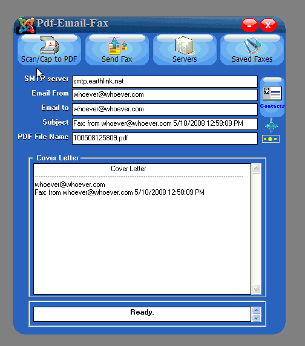



## Email Multipage Twain Scan or Screen Cap\(s\) as PDF

### Description

Update(5-13-08) &gt;&gt;&gt; You may scan a document (multipage) or screen capture(s) (multipage) into pdf files. The file is then attached to an email and sent to a recipient using SMTP. A list of various SMTP servers is included. The faxes may be previewed as can their cover letters and log. All faxes are stored and can be resent. Twain scanning is performed with "eztw32.dll" which is included and can be downloaded here: {http://www.geocities.com/smigman.geo/mci/download.html} The PDF file creation is based upon [http://www.vb6.us/tutorials/visual-basic-tutorial-pdf] and requires jpeg files. The BMP to jpg conversion requires "ijl15.dll" and was obtained here: [http://www.dll-files.com/dllindex/dll-files.shtml?ijl15] and is included. The email with attachment is based on txtCodeId=7519 and uses the winsock control. If you have Outlook, you may compile CntrlOutlk.exe file into the root and your Contacts List may be accessed using Microsoft Outlook 11.0 Object Library.
 
### More Info
 

             |
---                |---
**Submitted On**   |2008-05-11 11:32:48
**By**             |[Warren Goff](https://github.com/Planet-Source-Code/PSCIndex/blob/master/ByAuthor/warren-goff.md)
**Level**          |Intermediate
**User Rating**    |4.8 (29 globes from 6 users)
**Compatibility**  |VB 6\.0
**Category**       |[Complete Applications](https://github.com/Planet-Source-Code/PSCIndex/blob/master/ByCategory/complete-applications__1-27.md)
**World**          |[Visual Basic](https://github.com/Planet-Source-Code/PSCIndex/blob/master/ByWorld/visual-basic.md)
**Archive File**   |[Email\_Mult2112725132008\.zip](https://github.com/Planet-Source-Code/warren-goff-email-multipage-twain-scan-or-screen-cap-s-as-pdf__1-70491/archive/master.zip)

